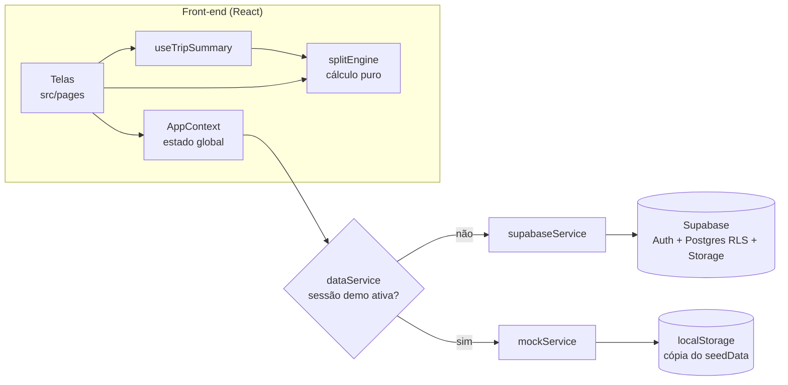
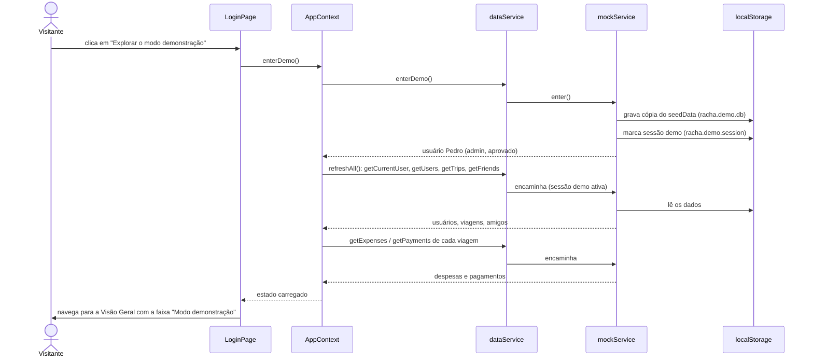
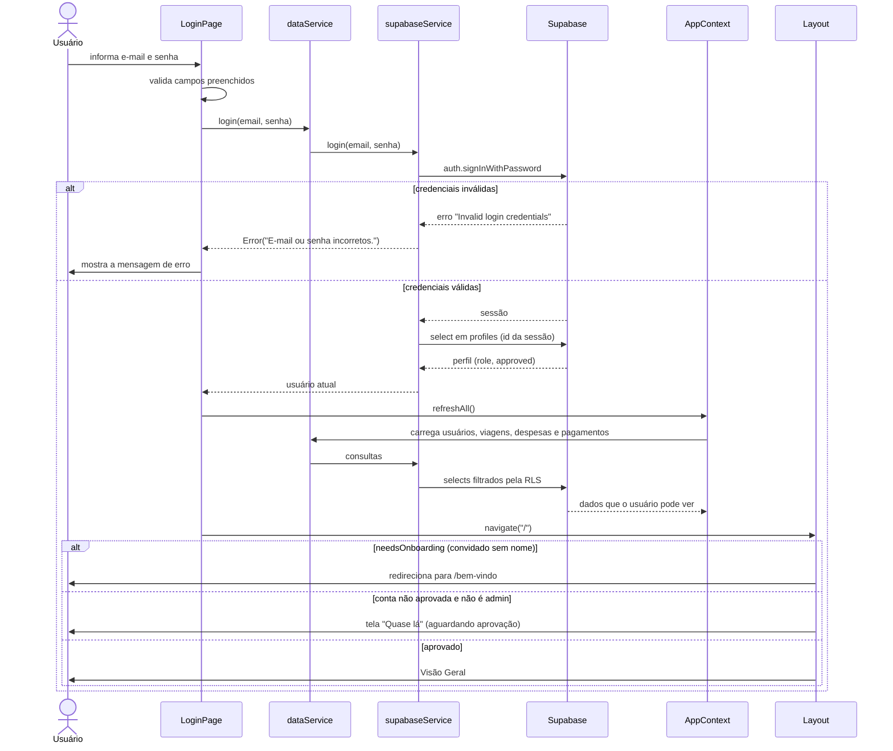
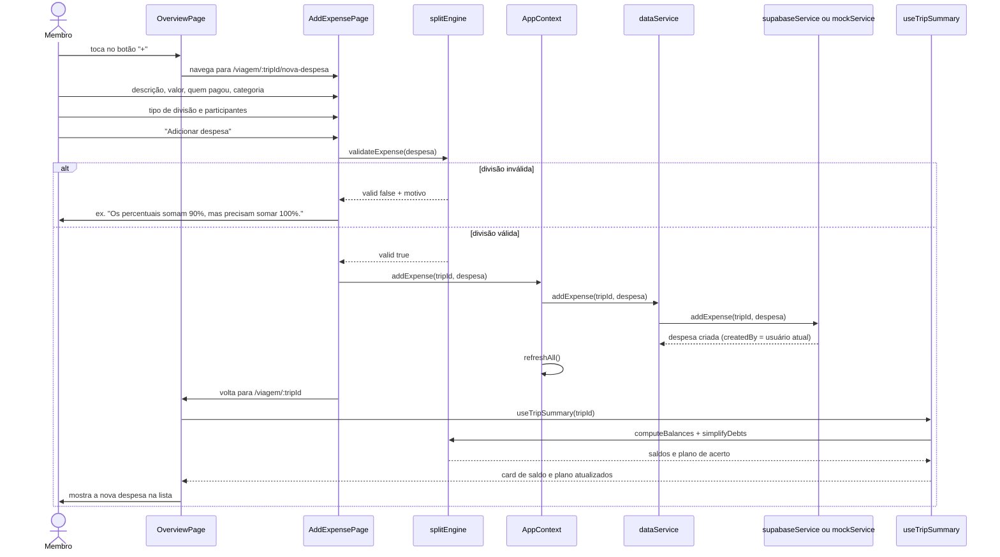
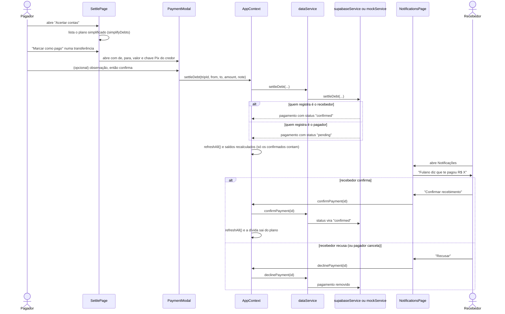
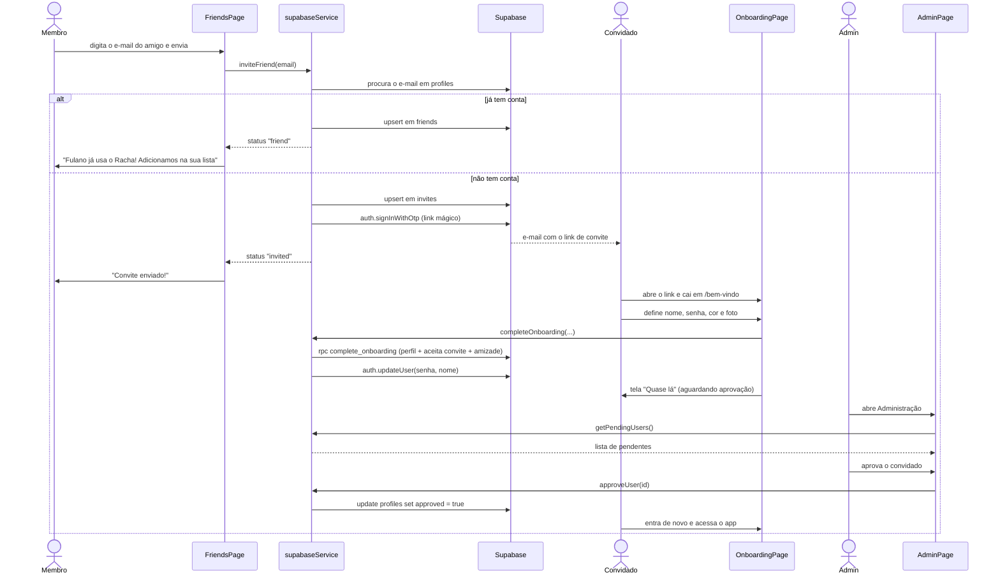
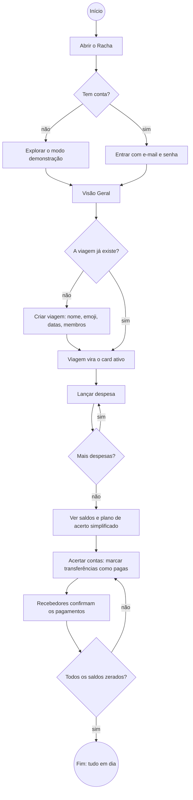
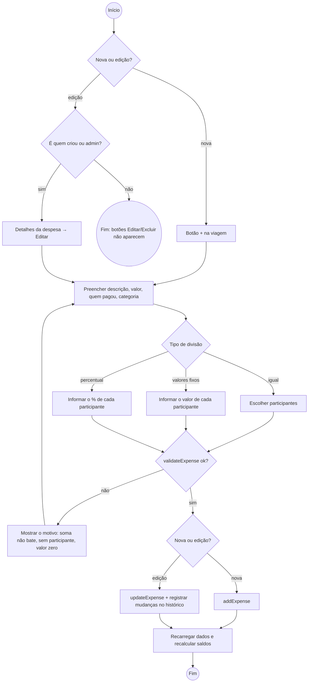
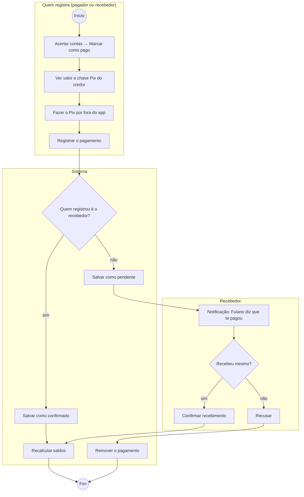
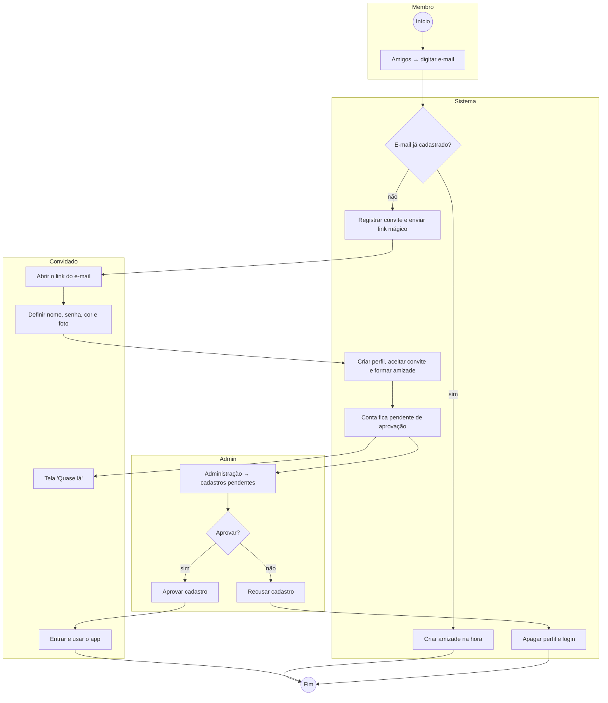

# Racha. — Diagramas UML (Checkpoint 5)

Diagramas dos fluxos **como estão implementados** no protótipo. Os nomes de
telas, funções e tabelas são os do código, para dar para seguir cada passo
direto nos arquivos. Os diagramas estão em [Mermaid](https://mermaid.js.org/)
e o GitHub desenha cada um direto nesta página.

- [1. Visão geral da arquitetura](#1-visão-geral-da-arquitetura)
- [2. Diagramas de sequência](#2-diagramas-de-sequência)
  - [2.1 Entrar no modo demonstração](#21-entrar-no-modo-demonstração)
  - [2.2 Login real e controle de acesso](#22-login-real-e-controle-de-acesso)
  - [2.3 Lançar despesa](#23-lançar-despesa)
  - [2.4 Acertar contas e confirmar pagamento](#24-acertar-contas-e-confirmar-pagamento)
  - [2.5 Convite por e-mail e aprovação do admin](#25-convite-por-e-mail-e-aprovação-do-admin)
- [3. Diagramas de atividade](#3-diagramas-de-atividade)
  - [3.1 Fluxo principal: da viagem ao acerto](#31-fluxo-principal-da-viagem-ao-acerto)
  - [3.2 Lançar ou editar despesa](#32-lançar-ou-editar-despesa)
  - [3.3 Registrar e confirmar pagamento](#33-registrar-e-confirmar-pagamento)
  - [3.4 Entrada de um novo membro por convite](#34-entrada-de-um-novo-membro-por-convite)

---

## 1. Visão geral da arquitetura

Toda tela fala com o `AppContext`, que chama o `dataService`. O
`dataService` decide, a cada chamada, se a resposta vem do banco real
(Supabase) ou dos dados fictícios do modo demonstração.

---

## 2. Diagramas de sequência

### 2.1 Entrar no modo demonstração

Fluxo usado na avaliação: entra sem cadastro, como admin de um grupo fictício.

### 2.2 Login real e controle de acesso

O `Layout` funciona como porteiro: sem sessão vai para o login, convidado sem
cadastro vai para `/bem-vindo` e conta não aprovada fica na tela de espera.

### 2.3 Lançar despesa

A validação acontece no front-end (`splitEngine`) antes de qualquer
gravação. Depois de salvar, o `AppContext` recarrega os dados e os saldos são
recalculados.

### 2.4 Acertar contas e confirmar pagamento

Quem **recebe** e registra o pagamento já o confirma. Quem **paga** e registra
fica pendente até o recebedor aceitar. Só pagamentos confirmados mexem no
saldo.

### 2.5 Convite por e-mail e aprovação do admin

Fluxo do app real (no modo demo o convite só aparece na lista, sem e-mail).

---

## 3. Diagramas de atividade

> Notação: `(( ))` = início/fim, losango = decisão, retângulo = ação.
> Nos diagramas com raias (swimlanes), cada bloco é um ator.

### 3.1 Fluxo principal: da viagem ao acerto

É o fluxo mostrado no vídeo de demonstração.

### 3.2 Lançar ou editar despesa

### 3.3 Registrar e confirmar pagamento

### 3.4 Entrada de um novo membro por convite

Só no app real. No modo demonstração, o passo "Aprovar cadastro" pode ser
testado com o usuário fictício **João Pedro**, que já está na fila.

